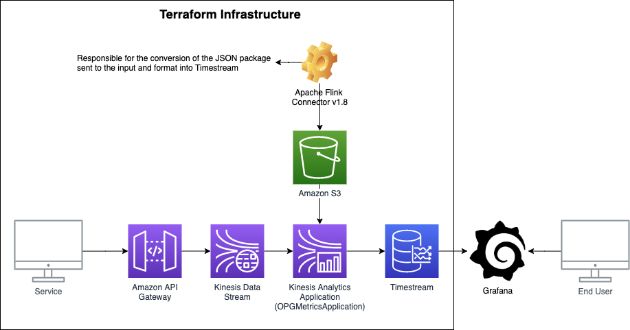

# OPG Metrics

## Integration and Mocking

Within the solution we have provided a [OpenAPI specification](/terraform/environment/api/openapi_spec.json) and an [example JSON packet](/terraform/environment/api/examples/put_metrics.json) for help in understanding the integration.

Upon a merge into `main` a Github Action will build and publish HTML documentation to github pages. This can be found here [https://ministryofjustice.github.io/opg-metrics/](https://ministryofjustice.github.io/opg-metrics/).

This OpenAPI specification can be used to build out a Mock service of your choosing. Below is an example using Prism.

You can run the Docker version of prism as part of your `docker-compose`.

```
metrics-api:
    image: stoplight/prism:latest
    ports:
      - 4010:4010
    command:
      - mock
      - https://github.com/ministryofjustice/opg-metrics/tree/main/terraform/environment/api/openapi_spec.json
      - -h
      - 0.0.0.0
      - --dynamic
```


The Office of the Public Guardian metrics service: Managed by opg-org-infra &amp; Terraform

Building a new metrics service for OPG.

## Overview
### Mission Statement

OPG has many 'things' to measure to aid in decision making, but these are not visible to all or easily accessible in one place, making it difficult to see patterns and connections, or high level problems across products.

### Problems this service aims to solve

* A common language that can be used across teams and OPG.
* Encourage and Gamify the culture of celebrating maintenance and managing legacy
* Understanding our users over time
* Hold ourselves accountable throughout the entire service life-cycle
* Think about performance and monitoring at the start and what done/good looks like
* Reduce barriers to entry for getting data


### How should you use this service

This service is not intended to be a place where you debug issues or store logs that you can diagnose problems. It is to enable you to pass key bits of information across multiple services so you can overlay data points, find patterns and maintain visibility of your service.

If you do find something happening you should use other tools that are built for this in mind to dig deeper into the issue.

### Example integrations

As the service can take data from a REST endpoint, it makes it easy for you to integrate external services. An example of a few services that could be used are below.

For a list of shared integrations please see [Plugins and integrations](#plugins-and-integrations) in this readme.

* CircleCI Orb
* Jenkins plugin
* Call center integration
* Offline data points
* Cloudwatch
* Jira
* AWS Cost Explorer
* Pa11y
* Google Analytics
* Real User Metrics
* Google Sheets
* Pager Duty


## Requirements

aws-vault for managing AWS access.

`brew install --cask aws-vault`

Terraform CLI for releasing to AWS and validation.

`brew install terraform`

If developing the app then ensure you have [pre-commit](https://pre-commit.com/) installed to take advantage of the pre-commit [hooks](.pre-commit-config.yaml) we've added to the project to make PRs a more consistent and enjoyable experience.

`brew install pre-commit`

## Infrastructure



## Using the service

The OPG Metrics Service allows you to send a PUT request to a endpoint with a JSON package in the body to record data. You don't have to use this point of entry however, the service is designed in a way that should you choose to, you can integrate directly with the Timestream database or the Kinesis Data Stream.

If you choose to use the API Gateway endpoint, you can use the information below.

### API Swagger Definition

The API Gateway is built using a swagger.json file that can be found in [/terraform/environment/swagger.json](./terraform/environment/swagger.json). You can use this to see the structure of the requests you need to make.

An example request would look like the below. The endpoint accepts an array of `records` which allow you to bulk send measurements.

```
curl --location --request PUT 'https://<api-endpoint>/prod/streams/opg-metrics/records' \
--header 'Content-Type: application/json' \
--data-raw '{
    "records": [
        {
            "data": "{ '\''Dimensions'\'': dimensions, '\''Project'\'': '\''opgtest'\'', '\''MeasureName'\'': '\''release'\'', '\''MeasureValue'\'': '\''1.0'\'', '\''MeasureValueType'\'': '\''DOUBLE'\'', '\''Time'\'': '\''1609240692503'\'' }",
            "partition-key": "key"
        },
        {
            "data": "{ '\''Dimensions'\'': dimensions, '\''Project'\'': '\''opgtest'\'', '\''MeasureName'\'': '\''release'\'', '\''MeasureValue'\'': '\''1.0'\'', '\''MeasureValueType'\'': '\''DOUBLE'\'', '\''Time'\'': '\''1609240692513'\'' }",
            "partition-key": "key"
        }
    ]
}'
```

## Plugins and integrations

Below are a list of existing integrations that have been done and can be used with the service. Should you wish to add your own to the list, please raise a PR with a link and description.

* TBC

## License

The OPG Metrics Service is released under the MIT license, a copy of which can be found in [LICENSE](LICENSE).
